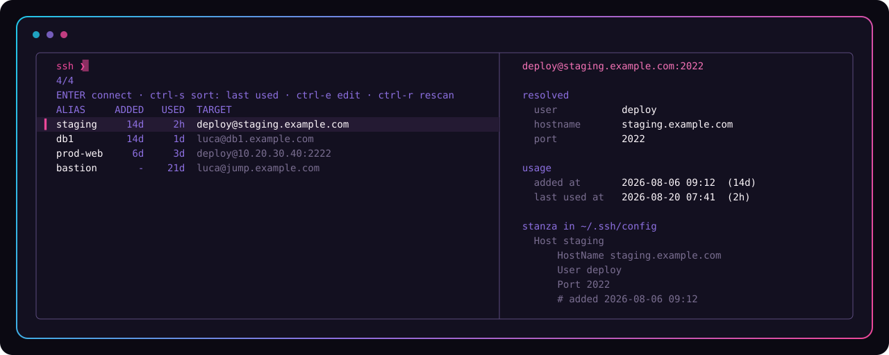

<p align="center">
  
</p>

<p align="center">
  <a href="https://github.com/infuriating/sushi/actions/workflows/test.yml">
    
  </a>
</p>

*ssh + ui, rearranged.* A fuzzy picker for your SSH hosts that builds itself from your shell
history — then gets out of the way.

```
ssh ⏎
```

<p align="center">
  
</p>

## The idea

You have already told your machine about every server you use — you just told it in the wrong
place. `~/.zsh_history` is full of `ssh deploy@10.20.30.40 -p 2222`, typed for the hundredth time,
while `~/.ssh/config` sits empty.

sushi reads the history, extracts the destinations, and writes them into `~/.ssh/config` as real
`Host` stanzas. That last part is the point: **the output is native ssh config, not a private
database.** Once a host is imported, `ssh staging`, `scp file staging:`, `rsync … staging:`,
`git clone staging:repo` and `ssh <TAB>` completion all work — with or without sushi installed.
The picker is a convenience on top; the config is the deliverable.

## Install

```bash
git clone https://github.com/infuriating/sushi.git ~/sushi
cd ~/sushi
./install.sh
source ~/.zshrc
```

`install.sh` adds one `source` line to `~/.zshrc` and copies nothing, so `git pull` is a complete
update. `./install.sh --uninstall` removes it again.

Reload with `source ~/.zshrc`, not `exec zsh`. In Warp — or any terminal that injects shell
integration at launch — `exec zsh` replaces the shell the terminal set up, and that pane loses the
terminal's own features (native SSH blocks, completions) until you close it. A new tab or pane is
always safe. Re-sourcing sushi is idempotent, so reloading repeatedly costs nothing.

Requires zsh, bash 3.2+ (macOS's system bash is fine) and [fzf](https://github.com/junegunn/fzf)
for the picker. `scan` and `list` work without fzf. fzf 0.36 or newer redraws the list in a single
paint when `ctrl-s` changes the ordering; older versions get the same orderings with a brief flicker
as the list is replaced.

## Use

```bash
sushi scan -n     # dry run: what it found, sorted by how often you used it
sushi scan        # pick hosts with TAB, import them into ~/.ssh/config
ssh               # the picker
ssh staging       # untouched — goes straight to the real ssh
```

…where `ssh` on its own opens the picker in the default mode. Inside it: type to filter, `ENTER` to
connect, `ctrl-s` to change the ordering, `ctrl-e` to edit `~/.ssh/config`, `ctrl-r` to rescan
history. In the `scan` picker, `ctrl-x` dismisses rows.

The picker is never ordered alphabetically by accident — `bastion` being first because it starts
with b is not useful. `ctrl-s` cycles the three orderings that are, and the header always says which
one you are looking at:

| | | |
|---|---|---|
| **last used** | the host you touched most recently, first | the default |
| **last added** | newest import first — what `scan` just brought in | |
| **most used** | the biggest count in your history, first | the old default |

Recency leads because it is the better guess: the host you were on an hour ago is usually the one
you want next, while a lifetime count keeps the box you hammered for a week last spring pinned to
the top forever. Rows the ordering knows nothing about — no `# added` date, no history — trail at
the bottom, A-Z among themselves.

`SUSHI_SORT` picks the mode the picker opens in: `used` (default), `added`, `count`, or `alpha` for
plain A-Z. `alpha` sits outside the cycle, so the first `ctrl-s` steps out of it into `last used`.
The mode you cycle to lasts for that picker session; the next `ssh` starts from `SUSHI_SORT` again.

Each ordering is built once per picker and re-read after that, so going back to one you have already
seen is free, and the whole cycle costs three builds and then nothing. It also keeps the ages
honest: they are frozen at the same instant for every mode, so `2h` cannot become `3h` halfway
round.

Each row also carries two ages, `ADDED` and `USED`, with the full dates in the preview pane as
`added at` and `last used at`. They sit between the alias and the target — the target is the column
worth fuzzy-matching, so it is never padded or cut, and the alias column widens to fit the longest
alias you have so the ages stay in line:

- **`added at`** is when sushi wrote the host into your config. It is a `# added <date>` line inside
  the stanza itself, written by `scan` and by `add` — not a database — so it survives, moves and gets
  deleted with the stanza it belongs to. Hosts you wrote by hand, and anything imported by an older
  sushi, read `unknown`.
- **`last used at`** is the newest dated `ssh` to that host in your shell history, matched the same
  way the frequency count is: on hostname+user, and on the alias itself. `never` means the history
  has no such host; `unknown` means it has one but your shell kept no dates. Only some history
  formats carry them — zsh with `setopt EXTENDED_HISTORY`, bash with `HISTTIMEFORMAT` set, and fish
  always. Plain zsh and plain bash write the command and nothing else, and sushi shows a dash rather
  than inventing a date.

Other commands: `sushi list` prints the host table, `sushi edit` opens the config,
`sushi theme` shows the palette in force (`theme list` and `theme set` for the rest), `sushi choose`
prints an alias instead of connecting (useful for your own scripts), `sushi doctor` checks the
binaries, `~/.ssh`, the integration and the theme, `sushi update` asks origin whether a newer
commit or release is out (then `git pull` to take it), and `sushi --version` says which build you
are on (plus the commit, since `git pull` is the update).

`sushi <TAB>` completes subcommands and your imported aliases. `ssh <TAB>` is deliberately left
alone: sushi writes real `Host` stanzas, so zsh's own `_ssh` already knows every alias — that is
the point of the config being the deliverable rather than a private database.

### Adding a host by hand

A server you have never SSH'd to cannot show up in your history, so `scan` will never offer it.
`sushi add` is the way in — same parser, same alias rules, same managed block:

```bash
sushi add deploy@web1.example.com
sushi add web1.example.com:2222              # the form sushi itself prints, pasted back
sushi add box.example.com -i ~/.ssh/work     # any ssh flag scan understands
sushi add --as staging deploy@10.20.30.40 -J bastion
sushi add -n deploy@web1.example.com         # dry run
```

Adding the same `user@host` twice is refused with the alias that already covers it — pass `--as` if
you genuinely want a second stanza for it, say on a different key.

### Sharing hosts

`sushi export` (alias `sushi share`) writes a text file of Host stanzas you can send to a colleague
or move to another machine. `sushi import` merges that file into the managed block of
`~/.ssh/config`.

```bash
sushi share                    # pick hosts, write ./sushi-share
sushi export staging web1      # named aliases, no picker
sushi export --all -o team.txt
# …send the file…
sushi import team.txt          # on the other machine
```

Only four fields travel: the alias (`Host`), `HostName`, `User`, and `Port`. `IdentityFile`,
`ProxyJump`, and private keys are stripped — the recipient points those at their own keys and
bastions. A share file is ordinary ssh_config, so a hand-written snippet imports the same way.

For moving yourself to a new laptop, add `--config` to also pack the ignore list, theme, and
sushi knobs (`SUSHI_MODE`, `SUSHI_SORT`, …):

```bash
sushi export --all --config -o me.txt
sushi import --config me.txt   # applies ignore / theme; prints the other knobs
```

`-n` is a dry run on both sides. Piped stdout defaults to stdout; a TTY writes `./sushi-share`
and refuses to clobber an existing file unless you pass `--force`.

### Making things go away

Your history accumulates hosts you'll never use again — a box that's been decommissioned, a
colleague's machine you SSH'd into once, a whole staging environment. Without somewhere to record
that, `scan` re-offers them forever.

```bash
sushi delete              # pick things to get rid of  (alias: sushi ignore)
sushi ignore 'root@*'     # or add patterns directly
sushi ignore '*.staging.acme.tld'
sushi ignore --list
sushi ignore --remove     # picker; or pass patterns
sushi ignore --edit       # open the file in $EDITOR
```

You can also dismiss rows without leaving `scan`: highlight one (or `TAB` several) and press
**`ctrl-x`**. They vanish immediately and never come back. Nothing is imported and `~/.ssh/config`
isn't touched — it's purely "stop showing me this".

`ctrl-x` is deliberately cheap. The candidate list is scanned once into a temp cache when the picker
opens; a keypress only appends a pattern to a pending file, and the redraw re-reads the cache minus
that file. The ignore list itself is written once, after the picker closes, however many rows you
dismissed. Doing the obvious thing instead — write the ignore file, then reload by re-scanning —
cost ~900ms per keypress on a 3000-line history; this is ~30ms.

`sushi delete` is the standalone version. It only ever offers things you haven't dealt with —
anything already on the ignore list is left out, since re-offering it in the picker you dismissed it
from is just noise. Use `--list` and `--remove` to see and undo the list itself.

Its picker offers two kinds of entry:

- **`scan`** — a candidate that hasn't been imported. Selecting it adds a pattern to the ignore
  list so it's never offered again.
- **`imported`** — a host already in `~/.ssh/config`. Selecting it **deletes its `Host` stanza**
  *and* adds the ignore pattern. Deleting without ignoring would just mean the next `scan` offers it
  straight back.

Stanza deletion only ever touches the sushi-managed block, so hand-written entries are safe, and it
goes through the same backup-and-`ssh -G`-validate path as import. A `Host` line naming several
patterns loses only the ones you picked; it survives while any remain.

The ignore list lives at `~/.ssh/sushi-ignore` (`SUSHI_IGNORE` to move it) — one glob per line,
`#` for comments, matched against both `user@host` and the bare host. It affects `scan` only;
`~/.ssh/config` and the picker are never filtered by it. `scan` reports how many candidates it hid
rather than quietly shrinking its list.

### Look

Cyan through violet to magenta, on the near-black of the nori — the same palette as the icon:

| | |
| --- | --- |
| `#22c7e8` cyan | match highlights, markers, key paths |
| `#8c6fe0` violet | headers, section labels, borders |
| `#ec4899` magenta | prompt, pointer, the `imported` tag |
| `#f472b6` rose | the resolved target in the preview |
| `#14101f` nori | — (the background is left transparent) |
| `#fdf7fb` rice | aliases and values |

The background is deliberately `-1`, so your terminal's own background and transparency show
through rather than being painted over.

That palette is a YAML file, so it is not the one you have to live with:

```bash
sushi theme set     # pick one in fzf, previewing each against your own hosts, and keep it
```

That is the whole loop. `theme set` opens a picker of every theme it can find; the preview pane
renders that theme's palette and the first rows of your own host table in it, so you are judging the
thing you will actually look at rather than a list of hex values. Choosing one writes
`export SUSHI_THEME=<name>` into your `~/.zshrc` and prints what it did. `theme set <name>` skips
the picker, and `theme set sushi` goes back to the built-in by removing the line again.

The rest of the surface:

```bash
sushi theme         # what you are running, where it came from, and what is in it
sushi theme list    # every theme found, grouped by directory so precedence is visible
SUSHI_THEME=ansi sushi   # try one without keeping it
```

To write your own, copy the shipped one and edit it — `~/.config/sushi/themes` is searched before
the clone, so your files survive a `git pull`:

```bash
mkdir -p ~/.config/sushi/themes
cp ~/sushi/themes/sushi.yaml ~/.config/sushi/themes/mine.yaml
$EDITOR ~/.config/sushi/themes/mine.yaml
SUSHI_THEME=mine sushi theme     # or just: sushi theme set, and look at it
```

A theme names six roles and the fzf colours, and nothing else — there is no layout or keybinding in
there, only colour:

```yaml
name: mine

accent:  "#22c7e8"   # match highlights, markers, key paths
heading: "#8c6fe0"   # headers and section labels
prompt:  "#ec4899"   # the `imported` tag
target:  "#f472b6"   # the resolved target in the preview
value:   bold "#fdf7fb"   # aliases and values
muted:   "#7a6e91"   # ages, keys, everything secondary

fzf:                 # handed to fzf as --color=..., verbatim
  hl: "#22c7e8"
  bg: "-1"

symbols:
  pointer: "▍"
  marker: "◆"
```

A colour is `"#rrggbb"`, the `"#rgb"` short form, a 0-255 terminal palette index, or `none`, and may
be preceded by any of `bold`, `dim`, `italic`, `underline`, `reverse`. Quote the hex: bare `#` starts
a YAML comment. Every key is optional — a theme is read on top of the built-in one, so a file with
two lines in it is a valid theme, and `none` on a role switches just that role off.

`SUSHI_THEME` takes a name or a path. A name is looked for in `$SUSHI_THEME_DIR`, then
`~/.config/sushi/themes` (which a `git pull` never touches), then `themes/` in the clone — sushi
ships `sushi` and `ansi` there, the second in terminal palette indexes so it follows whatever colour
scheme your terminal already has. `SUSHI_THEME=sushi` is the default and reads no file at all.
Anything sushi cannot parse is named on stderr and skipped rather than taking the picker down with
it — you can still reach your servers with a half-broken theme.

The line `theme set` writes goes *above* the `# >>> sushi >>>` block in your `~/.zshrc`, not inside
it: `install.sh` rewrites everything between its own markers on every run, so a theme kept in there
would disappear the next time you re-ran the installer. It backs the file up first
(`~/.zshrc.sushi-backup`), and if you already had a `SUSHI_THEME` line of your own it says so and
replaces it rather than adding a second one that silently competes.

Two escape hatches, for opting out rather than editing:

```bash
SUSHI_THEME=none            # no colours at all; FZF_DEFAULT_OPTS decides
SUSHI_FZF_OPTS='--height=40% --layout=default --preview-window=down,60%'
```

`SUSHI_FZF_OPTS` is appended after everything sushi passes, and fzf lets the later flag win, so it
overrides any of this — including the geometry the call sites set.

The pickers take the whole screen (`--height=100%`), which puts fzf on the alternate screen: resize
the terminal while one is open and it simply repaints, and closing it leaves your scrollback exactly
as it was. An inline `--height` of less than 100% is the one override worth knowing the cost of —
fzf then draws into the screen you are already on and anchors itself to a row that shrinking the
window scrolls away, so each resize strands another half-erased copy of the picker above the new one.

`sushi list` only colours itself when stdout is a terminal, so piping or capturing it gives you
clean text.

### Shell integration modes

How the picker is reached is configurable, because the obvious approach — defining a shell
function called `ssh` — has a real cost. Terminals that ship their own `ssh` completion (Warp, and
anything Fig-derived) key off the `ssh` command word, and shadowing it with a function turns that
completion off. So that mode exists, but it isn't the default.

| `SUSHI_MODE` | How you open the picker | Shadows `ssh`? |
| --- | --- | --- |
| `key` | a keybinding, `^S` by default | no |
| `enter` | press ENTER on a line containing only `ssh` | no |
| `wrap` | run `ssh` with no arguments | **yes** |
| `off` | only the `sushi` command | no |

Default is `key,enter` — combine any of them with commas.

`enter` is the interesting one: it binds the RETURN key, and if the buffer is exactly `ssh` it
rewrites it to `ssh <picked-host>` a moment before running. You get the same "just type ssh" feel
as `wrap`, but `ssh` stays a real command, so native completion keeps working.

It binds the *key* rather than redefining the `accept-line` *widget* on purpose. `accept-line` is
contested territory — zsh-autosuggestions wraps it (and re-wraps on every `precmd` by default),
zsh-syntax-highlighting wraps it, terminals add their own. `zle -N accept-line …` silently destroys
whoever held it, and which side loses depends on load order, so the same `.zshrc` ends up behaving
differently in different shells. Binding `^M` and then delegating with `zle accept-line` — by name,
not `.accept-line` — means sushi never owns the widget and every wrapper in the chain still runs.
Set `SUSHI_RETURN` if you need a different key.

`key` inserts at the cursor rather than replacing the line, which makes it useful beyond ssh —
type `scp report.pdf ` then hit `^S` and you get the host appended. Set `SUSHI_KEY_ACCEPT=1` if
you'd rather it run immediately instead of leaving the line for you to edit.

```bash
./install.sh --mode=enter        # switch modes any time; rewrites the ~/.zshrc block
./install.sh --mode=key --key='^G'
./install.sh --mode=off
```

All modes load only in interactive shells, so scripts, cron jobs and anything calling
`/usr/bin/ssh` directly are unaffected.

### Terminals with native SSH integration

Warp — and anything else that gives ssh sessions special treatment — recognises a session by the
**literal command line the shell runs**. A picker that connects on your behalf is invisible to it:
the terminal saw `sushi`, not `ssh`. You lose the session chip, the remote directory indicator, and
block-level integration.

So sushi never connects for you. Every mode ends with a real `ssh <host>` command line submitted
from your prompt:

- `key` inserts it into the line you're editing; you press ENTER
- `enter` rewrites the buffer to `ssh <host>` immediately before it runs
- bare `sushi` (and `sushi <query>`) pushes it onto your **next** prompt via zsh's `print -z`, so
  you press ENTER once more and the terminal sees a command you typed

That last ENTER is the price of native integration. If you'd rather skip it and connect straight
away, `SUSHI_EXEC=1` — with the understanding that Warp-style session detection then won't fire.

Either way the command lands in your shell history, so `↑` repeats it and the next `scan` sees it.

## Where the hosts come from

| Source | What it gives | Notes |
| --- | --- | --- |
| `~/.zsh_history`, `~/.bash_history`, `~/.zsh_sessions/*`, fish | user, host, port, **frequency**, last use | the useful one |
| `~/.ssh/config` | existing aliases | read, never duplicated |
| `~/.ssh/known_hosts` | hostnames only | see below |
| `~/.ssh/sushi-ignore` | what to leave out | see [Making things go away](#making-things-go-away) |

`known_hosts` is the source everyone reaches for first and it is the weakest of the three. It
stores host keys, so it has **no usernames at all**, and with `HashKnownHosts yes` — the default
on most systems — the hostnames are SHA-1 hashed and cannot be recovered. sushi offers the
unhashed entries with a commented-out `# User ?` line rather than guessing.

`-i` and `-J` are not just skipped, they're kept: `ssh -i ~/.ssh/deploy_key -J bastion@edge web1`
imports as a stanza with `IdentityFile` and `ProxyJump` already filled in, so a host behind a
bastion or on a specific key works without hand-editing. Anything that isn't plainly a path or a
destination is dropped rather than written into your config — an unexpanded `$HOME`, a path with
spaces. In the `scan` list those rows are flagged `key` and `via <bastion>`.

History parsing handles `-p`, `-l`, `-i`, `-o`, `-J` and friends, options before *or* after the
destination (`ssh host -p 2222` is valid OpenSSH), `ssh://user@host:port` URLs, quoting, and
`sudo`/`&&`/`;` prefixes. It ignores `scp`, `ssh-keygen`, commented-out lines and `ssh` appearing
inside a quoted string. Dates are read wherever the shell puts them: zsh keeps the epoch inline
(`: 1699999999:0;ssh host`), bash writes it on the line *before* the command and fish on the line
*after*, so those two histories are read with a line of context either side. The newest wins.
Two entries for the same `user@host` — one with an explicit port, one
without — collapse into a single host.

## What it does to `~/.ssh/config`

Everything sushi writes goes inside a marked block:

```
# >>> sushi managed hosts >>>
...
# <<< sushi managed hosts <<<
```

- **The block goes at the top of the file.** In `ssh_config` the *first* value found for a keyword
  wins, so a `Host *` block above it would silently override every `User` and `Port` sushi wrote.
- **Your content is never touched.** Hand-written stanzas, comments and `Include` directives are
  preserved verbatim, including edits you make inside the managed block.
- **A backup is written on every change** (`config.sushi-backup-<timestamp>`, last five kept).
- **The result is validated with `ssh -G` before it is committed.** If ssh cannot parse it, the
  original file is left byte-identical and the run aborts. Validation is skipped if your config
  already fails to parse, so a pre-existing problem can't lock you out.
- **Re-running is idempotent.** Hosts already covered by your config — by hostname+user or by
  alias — are not offered again.
- Modes are enforced: `700` on `~/.ssh`, `600` on the config.

## Limitations

- The destination has to appear literally in your history. Hosts you only ever reached through an
  alias, a `ProxyJump`, or a wrapper script won't be found.
- Bare IPv6 literals (`ssh 2001:db8::1`) are skipped — indistinguishable from `host:port` without
  guessing.
- The shell integration and the completion are zsh-only. bash and fish users can still use `sushi`
  as a command — `scan`, `add`, `list` and `ignore` need no integration at all.
- `SUSHI_MODE=wrap` disables terminal-native `ssh` completion, as described above. Use `enter`.
- `^S` is XOFF under legacy terminal flow control; `key` mode runs `stty -ixon` when that is the
  chosen key, and the picker does the same for as long as it is open so `ctrl-s` reaches fzf instead
  of freezing the screen. Both put your original tty settings back; pass `--key='^G'` if you'd
  rather `key` mode didn't touch them at all.
- Generated aliases are a best guess (first DNS label, or `srv-10-0-0-5` for an IP). Rename them —
  edits inside the managed block survive.
- On Linux, `gnome-sushi` also installs a `/usr/bin/sushi` (a file previewer). If you have it, one
  of the two wins on `$PATH`. macOS has no such clash.

## Tests

```bash
./test/run.sh        # ~360 assertions, no fzf or terminal needed
./test/run.sh -v     # show every assertion
```

The suite builds throwaway `$HOME`s and `.zshrc`s and checks the awkward parts: odd history lines,
glob safety, port collapsing, hashed `known_hosts`, alias collisions, managed-block ordering,
idempotency, refusal to write an unparseable config, what each `SUSHI_MODE` does and does not
touch, and `install.sh` being idempotent and fully reversible. CI runs it on Linux and macOS — the
macOS job exercises bash 3.2, which is what ships with the OS.

Two sections earn their keep beyond ordinary coverage. One feeds ~4,500 generated command lines
through both history parsers — the awk one that runs and the bash one it was transcribed from — and
requires byte-identical output, which is what makes touching that code safe. The other feeds in
bytes that are not valid UTF-8, because macOS's awk aborts the whole program on the first one it
sees and takes every host after it down silently.

## Licence

MIT — see [LICENSE](LICENSE).
